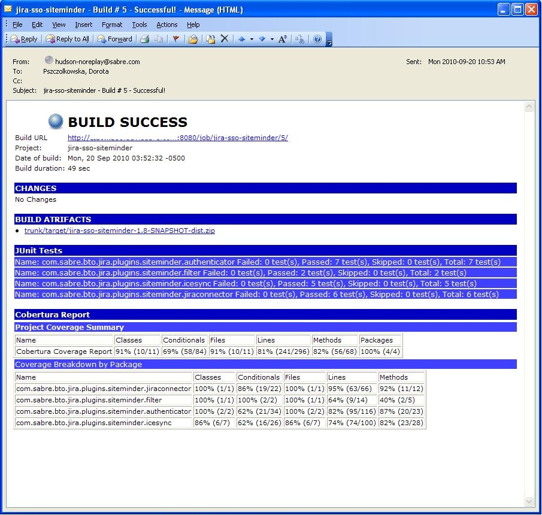
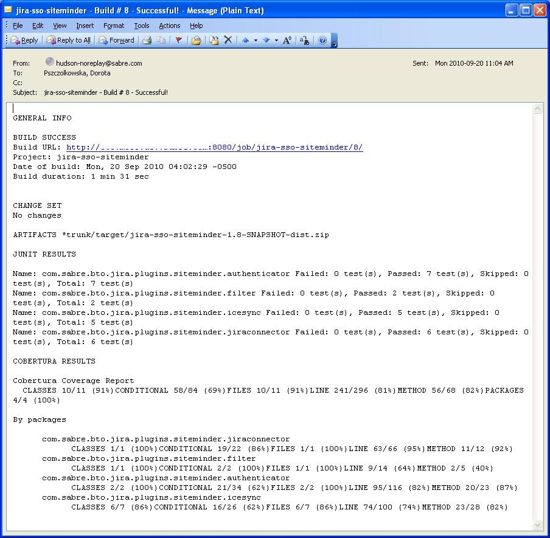

[[email-ext-plugin]]
= Email Extension Plugin
:toc: macro
:toc-title:
ifdef::env-github[]
:tip-caption: :bulb:
:note-caption: :information_source:
:important-caption: :heavy_exclamation_mark:
:caution-caption: :fire:
:warning-caption: :warning:
endif::[]

https://ci.jenkins.io/job/Plugins/job/email-ext-plugin/job/master/[image:https://ci.jenkins.io/job/Plugins/job/email-ext-plugin/job/master/badge/icon[Build Status]]
https://github.com/jenkinsci/email-ext-plugin/graphs/contributors[image:https://img.shields.io/github/contributors/jenkinsci/email-ext-plugin.svg[Contributors]]
https://plugins.jenkins.io/email-ext[image:https://img.shields.io/jenkins/plugin/v/email-ext.svg[Jenkins Plugin]]
https://github.com/jenkinsci/email-ext-plugin/releases/latest[image:https://img.shields.io/github/release/jenkinsci/email-ext-plugin.svg?label=changelog[GitHub release]]
https://plugins.jenkins.io/email-ext[image:https://img.shields.io/jenkins/plugin/i/email-ext.svg?color=blue[Jenkins Plugin Installs]]

This plugin allows you to configure every aspect of email notifications.
You can customize when an email is sent, who should receive it, and what the email says.

toc::[]

== Introduction

This plugin extends the https://plugins.jenkins.io/mailer/[Mailer plugin]'s functionality by giving you more control.
It provides customization of three areas:

* *Triggers* - Select the conditions that should cause an email notification to be sent.
* *Content* - Specify the content of each triggered email's subject and body.
* *Recipients* - Specify who should receive an email when it is triggered.

== Questions and Issues

If you need help, please post on the https://jenkins.io/mailing-lists/[Jenkins users mailing list] or https://stackoverflow.com/questions/tagged/email-ext[Stack Overflow].

Report bugs and requests for enhancement in the https://issues.jenkins.io/[Jenkins issue tracker] (no support tickets, please).
Use the `email-ext-plugin` component in the `JENKINS` project.

== Documentation

* xref:docs/recipes.adoc[Recipes]
* https://github.com/jenkinsci/.github/blob/master/CONTRIBUTING.md[Contribution guidelines]
* xref:CHANGELOG.adoc[Changelog]

== Getting Started

=== System-wide configuration

Before using this plugin from a project, you must first configure some system-wide settings.
Go to the Jenkins system-wide configuration page (*Manage Jenkins*, *Configure System*).

The configuration for this plugin can be found in the section entitled *Extended E-mail Notification*.
This configuration should match the settings for your SMTP mail server.
This section mirrors that of the https://plugins.jenkins.io/mailer/[Mailer plugin] in the *E-mail Notification* section; however, there are a few additions.
The fields labeled *Default Subject* and *Default Content* allow you to configure the subject and content on a system-wide level.
The field labeled *Default Recipients* can be used to set a default list of email addresses for all projects using this plugin (and can be overridden at the project level); this can be used to greatly simplify the configuration you need to do for all projects.

=== Project configuration

For a project to use this plugin, you need to enable it in the project configuration page.
In the *Post-build Actions* section, click on *Add post-build action* and then select *Editable Email Notification*.

There are three main fields that you can edit when this plugin is enabled:

* *Project Recipient List* - This is a comma (or whitespace) separated list of email recipients. Allows you to specify a single recipient list for each email that is sent.
* *Default Subject* - This allows you to configure a token (more about tokens later) that can be used to easily configure all email subjects for the project.
* *Default Content* - Same as *Default Subject*, but for the email body instead of the subject.

=== Pipeline step

This plugin can be used from https://www.jenkins.io/doc/book/pipeline/[Pipeline] via the https://jenkins.io/doc/pipeline/steps/email-ext/[`emailext`] step:

[source,groovy]
----
emailext body: 'Test Message',
    subject: 'Test Subject',
    to: 'test@example.com'
----

Use the `recipientProviders` parameter to add additional recipients.
For example, to add all the people who caused a change in the change set and the user who initiated the build:

[source,groovy]
----
emailext body: 'Test Message',
    recipientProviders: [developers(), requestor()],
    subject: 'Test Subject',
    to: 'test@example.com'
----

The recipient providers from this plugin can also be used with the https://plugins.jenkins.io/mailer/[Mailer plugin].
For example, to add culprits and the user who initiated the build:

[source,groovy]
----
step([$class: 'Mailer',
  notifyEveryUnstableBuild: true,
  recipients: emailextrecipients([culprits(), requestor()])])
----

== Usage

To see the advanced configuration for this plugin, click on the *Advanced* button.
This section allows you to specify recipients for each type of email trigger as well as a pre-send script that can be used to modify the email prior to sending.

=== Pre-send Scripts and Post-send Scripts

This feature allows you to write a script that can modify the https://docs.oracle.com/javaee/7/api/javax/mail/internet/MimeMessage.html[`MimeMessage`] object before or after sending the email.
This allows adding custom headers, modifying the body, etc.
Predefined variables include:

* `msg` (https://docs.oracle.com/javaee/7/api/javax/mail/internet/MimeMessage.html[`javax.mail.internet.MimeMessage`]) - The MIME email message object, which can be modified.
* `logger` (https://docs.oracle.com/javase/8/docs/api/java/io/PrintStream.html[`java.io.PrintStream`]) - A `PrintStream` that can be used to log messages to the build log.
* `build` (https://javadoc.jenkins.io/hudson/model/AbstractBuild.html[`hudson.model.AbstractBuild`]) - The build this message belongs to (only use with Freestyle projects).
* `run` (https://javadoc.jenkins.io/hudson/model/Run.html[`hudson.model.Run`]) - The build this message belongs to (may be used with Freestyle projects or Pipeline).
* `cancel` (boolean) - When set to true, cancels the sending of the email.

=== Triggers

By default, the only trigger configured is the *Failure - Any* trigger.
To add more triggers, select one from the drop-down and it will be added to the list.
Once you have added a trigger, you have several options.
To see what conditions must be met for this plugin to send an email, click on the "?" (question mark) next to the trigger.

* *Recipient List* - Add this recipient provider if you would like to have the email sent to the *Project Recipient List* configured above.
* *Developers* - Add this recipient provider to send the email to anyone who checked in code for the last build. This plugin will generate an email address based on the committer's ID and an appended *Default user e-mail suffix* from the *Extended E-mail Notification section* of the *Configure System* page. For example, if a change was committed by someone with an ID of `first.last`, and the default user e-mail suffix is `@example.com`, then an email will be sent to `first.last@example.com`.
* *Requestor* - Add this recipient provider to send an email to the user who initiated the build (if initiated by a user manually).
* *Include Culprits* - If this recipient provider _and_ the *Developers* recipient provider are added, emails will include everyone who committed since the last successful build.
* *Advanced* - Configure properties at a per-trigger level.
 ** *Recipient List* - A comma (or whitespace) separated list of email address that should receive this email if it is triggered. This list is appended to the *Project Recipient List* described above.
 ** *Subject* - Specify the subject line of the selected email.
 ** *Content* - Specify the body of the selected email.

You can also add *Script - After Build* or *Script - Before Build* triggers to a project to use Groovy scripts to define before or after the build whether or not the email will be sent.
The script is defined in the *Groovy Script* section of the trigger.
There are four objects added to the model for the script to use to interact with the build:

* `out` (https://docs.oracle.com/javase/8/docs/api/java/io/PrintStream.html[`java.io.PrintStream`]): A `PrintStream` that can be used to log messages to the build log.
* `build` (https://javadoc.jenkins.io/hudson/model/AbstractBuild.html[`hudson.model.AbstractBuild`]): This is the current build, usually a subclass of `AbstractBuild`.
* `project` (https://javadoc.jenkins.io/hudson/model/AbstractProject.html[`hudson.model.AbstractProject`]): The project object that the current build was started from, usually a subclass of `AbstractProject`.
* `rooturl` (https://docs.oracle.com/javase/8/docs/api/java/lang/String.html[`String`]): The Jenkins instance root URL, useful for links.

The last line in the script should resolve to a boolean (`true` or `false`):

* *Script - Before Build*:

[source,groovy]
----
// this could be used to notify people that a new build is happening
build.previousBuild.result.toString().equals('FAILURE')
----

* *Script - After Build*:

[source,groovy]
----
// only send am email if the build failed and 'mickeymouse' had a commit
build.result.toString().equals('FAILURE') && build.hasParticipant(User.get('mickeymouse'))
----

[source,groovy]
----
// only send an email if the word {{ERROR}} is found in build logs
build.logFile.text.readLines().any { it =~ /.*ERROR.*/ }
----

=== Tokens

This plugin uses *tokens* to allow dynamic data to be inserted into recipient list, subject line, or body.
A *token* is a string that starts with a `$` (dollar sign) and is terminated by whitespace.
When an email is triggered, a token in the subject or content fields will be replaced dynamically by the actual value that it represents.
Also, the value of a token can contain other tokens that will themselves be replaced by actual content.
For instance, the `$DEFAULT_SUBJECT` token is replaced by the text (and other tokens) that is in the *Default Subject* field from the *Extended E-mail Notification* section of the *Configure System* page.
Similarly, the `$PROJECT_DEFAULT_SUBJECT` token will be replaced by the value of the *Default Subject* field from the project configuration page.

This plugin sets the email content fields with default values when you enable it for your project.
The *Default Subject* and *Default Content* fields on the project configuration page default to `$DEFAULT_SUBJECT` and `$DEFAULT_CONTENT` (respectively), delegating to the the system-wide configuration from the *Extended E-mail Notification* section of the *Configure System* page.
Similarly, the per-trigger content fields default to `$PROJECT_DEFAULT_SUBJECT` and `$PROJECT_DEFAULT_CONTENT`, delegating to the project's configuration.
Since the value of a token can contain other tokens, this provides different points of configuration that can allow you to quickly make changes at the broadest level (all projects), the narrowest level (individual emails), and in-between (individual projects).

To see a list of all available email tokens and what they display, click on the "?" (question mark) associated with the *Content Token Reference* in the *Editable Email Notification* section of the project configuration page.

As of version 2.22, this plugin also supports tokens provided by the https://plugins.jenkins.io/token-macro/[Token Macro plugin].
You can see the available *Token Macro Plugin Tokens* below the *Extended Email Publisher Specific Tokens* when you click on the "?" (question mark) associated with the *Content Token Reference* in the *Editable Email Notification* section of the project configuration page.

=== Jelly script content templates

New to version 2.9 is the ability to use Jelly scripts.
Jelly scripts are powerful in that you can hook into the Jenkins API to get any information you want or need.
Two Jelly scripts are packaged with this plugin, and it is also possible to write your own.

There are two default Jelly scripts available out of the box; one is designed for HTML emails, and the other is designed for text emails.
See the screenshots below for what these templates look like.
You can specify which script you want by using the `template` argument.
The usage for each type of script is as follows:

* Text only Jelly script: `${JELLY_SCRIPT,template="text"}`
* HTML Jelly script: `${JELLY_SCRIPT,template="html"}`

You can also write your own Jelly scripts.
The Jelly scripts are particularly powerful since they provide a hook into the Jenkins API, including https://javadoc.jenkins.io/hudson/model/AbstractBuild.html[`hudson.model.AbstractBuild`] and https://javadoc.jenkins.io/hudson/model/AbstractProject.html[`hudson.model.AbstractProject`].
For an example on how to do this, take a look at the existing https://github.com/jenkinsci/email-ext-plugin/blob/master/src/main/resources/hudson/plugins/emailext/templates/html.jelly[`html`] and https://github.com/jenkinsci/email-ext-plugin/blob/master/src/main/resources/hudson/plugins/emailext/templates/text.jelly[`text`] scripts.

Using custom Jelly scripts (those not packaged with this plugin) requires the cooperation of your Jenkins administrator.
The steps are relatively simple:

. Create the Jelly script template. The name of the script should be `<name>.jelly`. It is important that the name ends in `.jelly`.
. Have your Jenkins administrator place the script inside `${JENKINS_HOME}/email-templates/`.
. Use the `$JELLY_SCRIPT` token with the `template` parameter equal to your script filename without the `.jelly` extension. For example, if the script filename is `foobar.jelly`, the email content would be `${JELLY_SCRIPT,template="foobar"}`.

Jelly script tips:

* You can get the object of other plugin actions by querying build actions like: `${it.getAction('hudson.plugins.fitnesse.FitnesseResultsAction')}`
* Then you need to know what functions are allowed by this action object and traverse through the result.

=== Groovy script content templates

New to version 2.15 is the ability to use Groovy scripts.
Scripts are powerful in that you can hook into the Jenkins API to get any information you want or need.
There are two scripts with corresponding templates packaged with this plugin, and it is also possible to write your own.

There are two default scripts and templates available out of the box; one is designed for HTML emails and the other is design for text emails.
You can specify which script you want by using the `script` argument; you can also leave the default script and specify a different template file using the `template` argument.
Furthermore, you can also include a script that does some initialization using the `init` argument.
The usage for each type of script is as follows:

* Text only Groovy script: `${SCRIPT, template="groovy-text.template"}`
* HTML Groovy script: `${SCRIPT, template="groovy-html.template"}`

You can also write your own scripts and templates.
The scripts are particularly powerful since they provide a hook into the Jenkins API, including https://javadoc.jenkins.io/hudson/model/AbstractBuild.html[`hudson.model.AbstractBuild`] and https://javadoc.jenkins.io/hudson/model/AbstractProject.html[`hudson.model.AbstractProject`].
For an example on how to do this, take a look at the existing https://github.com/jenkinsci/email-ext-plugin/blob/master/src/main/resources/hudson/plugins/emailext/templates/groovy-html.template[`html`] and https://github.com/jenkinsci/email-ext-plugin/blob/master/src/main/resources/hudson/plugins/emailext/templates/groovy-text.template[`text`] scripts.

Using custom scripts (those not packaged with this plugin) requires the cooperation of your Jenkins administrator.
The steps are relatively simple:

. Create the Groovy script template. The name of the script ends in the standard extension for the language (i.e., `.groovy`). The template can be named anything.
. Have your Jenkins administrator place the script inside `${JENKINS_HOME}/email-templates/`.
. Use the `$SCRIPT` token with the template parameter equal to your template filename, or in addition the script parameter equal to the custom script name. For example, if the template filename is `foobar.template`, the email content would be `${SCRIPT, template="foobar.template"}`.

Refer to the following examples for doing various things with the built-in Groovy templates:

* link:/docs/templates/jenkins-matrix-email-html.template[`jenkins-matrix-email-html.template`]
* link:/docs/templates/jenkins-generic-matrix-email-html.template[`jenkins-generic-matrix-email-html.template`]

=== Attachments

New to version 2.15 is the ability to add attachments using https://ant.apache.org/manual/Types/fileset.html[the Ant pattern matching syntax] used in many places in Jenkins.
You can set a maximum total attachment size in the *Extended E-mail Notification* section of the *Configure System* page; otherwise, it will be unlimited.

=== Jive Formatter

link:/docs/templates/jive-formatter.groovy[`jive-formatter.groovy`] contains methods for easy and convenient formatting of emails being sent from Jenkins to Jive.
It should be called from the *Pre-send Script* area.
Also, it doesn't seem like Jive supports text with multiple formats, so only call one formatting method per block of text.

Either `formatLine` or `formatText` can and should be called on every line of text that will be sent to the Jive system prior to calling formatting methods like color or size.
Please test on your own instances of Jive and add functionality as you find it!

The following lines should be added to the *Pre-send Script* area prior to attempting to invoke any functions:

[source,groovy]
----
File sourceFile = new File("/your/preferred/path/jive-formatter.groovy");
Class groovyClass = new GroovyClassLoader(getClass().getClassLoader()).parseClass(sourceFile);
GroovyObject jiveFormatter = (GroovyObject) groovyClass.newInstance();
----

== Related Plugins

* https://plugins.jenkins.io/email-ext-recipients-column/[Email Ext Recipients Column plugin]
* https://plugins.jenkins.io/job-direct-mail/[Job Direct Mail plugin]
* https://plugins.jenkins.io/pom2config/[pom2config plugin]
* https://plugins.jenkins.io/github-pullrequest/[GitHub Integration plugin]
* https://plugins.jenkins.io/emailext-template/[Email-ext Template plugin]
* https://plugins.jenkins.io/configurationslicing/[Configuration Slicing plugin]
* https://plugins.jenkins.io/view-job-filters/[View Job Filters plugin]
* https://plugins.jenkins.io/run-condition-extras/[Run Condition Extras plugin]
