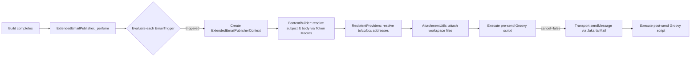

# Email-Ext Plugin — Code Structure Walkthrough

## Overview

The **Jenkins Email Extension Plugin** (`email-ext-plugin`) extends Jenkins' built-in email notification with rich customization: per-trigger email configuration, multiple recipient strategies, Groovy scripting, template-based content, and Pipeline support via `emailext` DSL step.

---

## Project Layout

```
email-ext-plugin/
├── pom.xml                          # Maven build: packaging=hpi (Jenkins plugin)
├── Jenkinsfile                      # CI pipeline
├── CHANGELOG.adoc / README.adoc     # Docs
├── src/
│   ├── main/
│   │   ├── java/hudson/plugins/emailext/   # Core Java source
│   │   ├── resources/                       # Jelly views, i18n, config
│   │   └── webapp/                          # Static web assets
│   └── test/                                # Unit/integration tests
└── docs/                                    # Additional docs
```

---

## Core Package: `hudson.plugins.emailext`

### Central Classes

| Class | Role |
|-------|------|
| [ExtendedEmailPublisher.java](file:///c:/gsocE/email-ext-plugin/src/main/java/hudson/plugins/emailext/ExtendedEmailPublisher.java) | **The publisher** — extends `Notifier`. Evaluates triggers, composes MIME messages, runs pre/post-send Groovy scripts, and sends emails via Jakarta Mail. (~1327 lines) |
| [ExtendedEmailPublisherDescriptor.java](file:///c:/gsocE/email-ext-plugin/src/main/java/hudson/plugins/emailext/ExtendedEmailPublisherDescriptor.java) | **Global config descriptor** — `@Extension` singleton. Stores SMTP settings, default subject/body/scripts, mail accounts, throttling, etc. Creates [Session](file:///c:/gsocE/email-ext-plugin/src/main/java/hudson/plugins/emailext/ExtendedEmailPublisherDescriptor.java#338-421) objects. (~930 lines) |
| [EmailExtStep.java](file:///c:/gsocE/email-ext-plugin/src/main/java/hudson/plugins/emailext/EmailExtStep.java) | **Pipeline step** — exposes `emailext(subject, body, …)` DSL via `@Extension(optional=true)`. Inner [EmailExtStepExecution](file:///c:/gsocE/email-ext-plugin/src/main/java/hudson/plugins/emailext/EmailExtStep.java#195-270) creates a temporary [ExtendedEmailPublisher](file:///c:/gsocE/email-ext-plugin/src/main/java/hudson/plugins/emailext/ExtendedEmailPublisher.java#103-1327) and calls [sendMail](file:///c:/gsocE/email-ext-plugin/src/main/java/hudson/plugins/emailext/ExtendedEmailPublisher.java#530-735). |
| [EmailExtRecipientStep.java](file:///c:/gsocE/email-ext-plugin/src/main/java/hudson/plugins/emailext/EmailExtRecipientStep.java) | Pipeline step for resolving recipient lists. |

### Supporting Classes

| Class | Purpose |
|-------|---------|
| [EmailType.java](file:///c:/gsocE/email-ext-plugin/src/main/java/hudson/plugins/emailext/EmailType.java) | Data object for a single email config (subject, body, recipients, attachments, content type) |
| [MailAccount.java](file:///c:/gsocE/email-ext-plugin/src/main/java/hudson/plugins/emailext/MailAccount.java) | SMTP account configuration (host, port, credentials, SSL/TLS, OAuth2) |
| [EmailRecipientUtils.java](file:///c:/gsocE/email-ext-plugin/src/main/java/hudson/plugins/emailext/EmailRecipientUtils.java) | Utility: resolves recipient addresses from env vars, user lookups |
| [AttachmentUtils.java](file:///c:/gsocE/email-ext-plugin/src/main/java/hudson/plugins/emailext/AttachmentUtils.java) | Utility: finds and attaches workspace files matching patterns |
| [EmailThrottler.java](file:///c:/gsocE/email-ext-plugin/src/main/java/hudson/plugins/emailext/EmailThrottler.java) | Rate-limiting singleton for outgoing emails |
| [ExtendedEmailPublisherContext.java](file:///c:/gsocE/email-ext-plugin/src/main/java/hudson/plugins/emailext/ExtendedEmailPublisherContext.java) | Contextual state bag passed through the send pipeline |
| [EmailExtTemplateAction.java](file:///c:/gsocE/email-ext-plugin/src/main/java/hudson/plugins/emailext/EmailExtTemplateAction.java) | Exposes email template testing UI in the Jenkins sidebar |
| [Util.java](file:///c:/gsocE/email-ext-plugin/src/main/java/hudson/plugins/emailext/Util.java) | Common helpers |
| [MatrixTriggerMode.java](file:///c:/gsocE/email-ext-plugin/src/main/java/hudson/plugins/emailext/MatrixTriggerMode.java) | Enum: `ONLY_CONFIGURATIONS`, `ONLY_PARENT`, `BOTH` |
| [GroovyScriptPath.java](file:///c:/gsocE/email-ext-plugin/src/main/java/hudson/plugins/emailext/GroovyScriptPath.java) / [GroovyTemplateConfig.java](file:///c:/gsocE/email-ext-plugin/src/main/java/hudson/plugins/emailext/GroovyTemplateConfig.java) / [JellyTemplateConfig.java](file:///c:/gsocE/email-ext-plugin/src/main/java/hudson/plugins/emailext/JellyTemplateConfig.java) | Template resolution config |

---

## Plugin System: `plugins/` sub-package

### Triggers (`plugins/trigger/`)

Abstract base: [EmailTrigger.java](file:///c:/gsocE/email-ext-plugin/src/main/java/hudson/plugins/emailext/plugins/EmailTrigger.java) — each trigger decides **when** to send email based on build result. Key method: [trigger(AbstractBuild, TaskListener) → boolean](file:///c:/gsocE/email-ext-plugin/src/main/java/hudson/plugins/emailext/plugins/EmailTrigger.java#112-122).

**23 concrete triggers:**

| Category | Triggers |
|----------|----------|
| **Always** | `AlwaysTrigger`, `PreBuildTrigger` |
| **Result-based** | `SuccessTrigger`, `FailureTrigger`, `UnstableTrigger`, `AbortedTrigger`, `NotBuiltTrigger`, `BuildingTrigger` |
| **First occurrence** | `FirstFailureTrigger`, `FirstUnstableTrigger`, `SecondFailureTrigger` |
| **Nth failure** | `NthFailureTrigger`, `XNthFailureTrigger` |
| **Transition** | `FixedTrigger`, `FixedUnhealthyTrigger`, `RegressionTrigger`, `ImprovementTrigger`, `StatusChangedTrigger` |
| **Persistent** | `StillFailingTrigger`, `StillUnstableTrigger` |
| **Script-based** | `ScriptTrigger`, `PreBuildScriptTrigger` (extend `AbstractScriptTrigger`) |

### Recipient Providers (`plugins/recipients/`)

Abstract base: [RecipientProvider.java](file:///c:/gsocE/email-ext-plugin/src/main/java/hudson/plugins/emailext/plugins/RecipientProvider.java) — each provider determines **who** receives the email. Key method: [addRecipients(context, env, to, cc, bcc)](file:///c:/gsocE/email-ext-plugin/src/main/java/hudson/plugins/emailext/plugins/RecipientProvider.java#71-77).

**12 providers:** `ListRecipientProvider`, `DevelopersRecipientProvider`, `CulpritsRecipientProvider`, `RequesterRecipientProvider`, `BuildUserRecipientProvider`, `ContributorMetadataRecipientProvider`, `FailingTestSuspectsRecipientProvider`, `FirstFailingBuildSuspectsRecipientProvider`, `PreviousRecipientProvider`, `UpstreamComitterRecipientProvider`, `UpstreamComitterSinceLastSuccessRecipientProvider`, `RecipientProviderUtilities` (shared helpers).

### Content Providers (`plugins/content/`)

**10 classes** that generate dynamic email content using Token Macros:

- `ScriptContent` / `JellyScriptContent` / `EmailExtScript` — Groovy & Jelly template rendering
- `FailedTestsContent` / `TestCountsContent` — test result summaries
- `TemplateContent` — loads templates from `$JENKINS_HOME/email-templates/`
- `TriggerNameContent` — name of the trigger that fired
- `AbstractEvalContent` — shared base for script evaluation
- `ContentBuilder` / `CssInliner` — compose final HTML, inline CSS

---

## Groovy Sandbox: `groovy/sandbox/`

**9 whitelist classes** that define what Java/Jakarta APIs are available inside sandboxed Groovy scripts:

`EmailExtScriptTokenMacroWhitelist`, `MimeMessageInstanceWhitelist`, `PrintStreamInstanceWhitelist`, `PropertiesInstanceWhitelist`, `TaskListenerInstanceWhitelist`, `ObjectInstanceWhitelist`, `StaticJakartaMailWhitelist`, `StaticProxyInstanceWhitelist`, and a custom `SimpleTemplateEngine`.

---

## Watching: `watching/`

| Class | Purpose |
|-------|---------|
| [EmailExtWatchAction.java](file:///c:/gsocE/email-ext-plugin/src/main/java/hudson/plugins/emailext/watching/EmailExtWatchAction.java) | Sidebar action: lets users "watch" a job and configure personal triggers |
| [EmailExtWatchJobProperty.java](file:///c:/gsocE/email-ext-plugin/src/main/java/hudson/plugins/emailext/watching/EmailExtWatchJobProperty.java) | Job property: stores the list of watchers |

---

## Data Flow (Simplified)



---

## Key Design Patterns

1. **Extension Points** — [EmailTrigger](file:///c:/gsocE/email-ext-plugin/src/main/java/hudson/plugins/emailext/plugins/EmailTrigger.java#28-263), [RecipientProvider](file:///c:/gsocE/email-ext-plugin/src/main/java/hudson/plugins/emailext/plugins/RecipientProvider.java#24-78), and content tokens are all Jenkins `ExtensionPoint`s, discoverable via `@Extension`
2. **Descriptor pattern** — [ExtendedEmailPublisherDescriptor](file:///c:/gsocE/email-ext-plugin/src/main/java/hudson/plugins/emailext/ExtendedEmailPublisherDescriptor.java#57-930) is the `@Extension` singleton holding global config; individual publishers hold per-job config
3. **Groovy sandboxing** — pre/post-send scripts run through `script-security-plugin` with custom whitelists
4. **Pipeline integration** — [EmailExtStep](file:///c:/gsocE/email-ext-plugin/src/main/java/hudson/plugins/emailext/EmailExtStep.java#36-300) wraps the Freestyle publisher logic for Pipeline use (`emailext(…)`)
